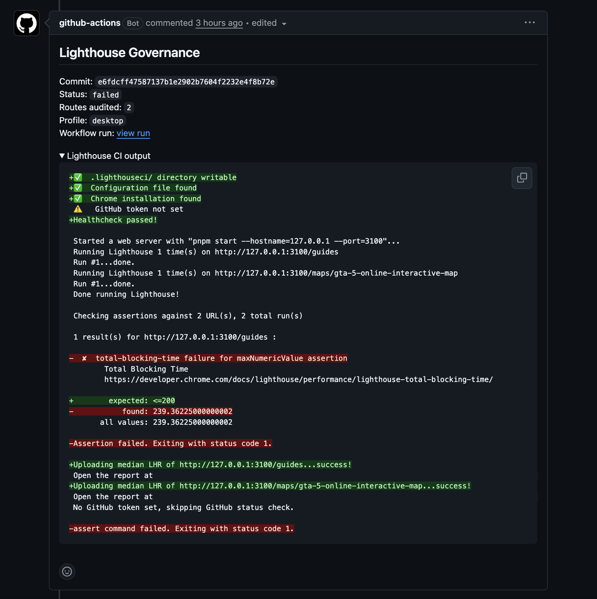

# Lighthouse Governance

Reusable Lighthouse CI governance for web projects. The action builds a project, generates a route manifest from discovered Next.js routes or configured routes, runs Lighthouse CI, and fails the workflow when configured thresholds fail.

## What It Does

- Discovers static routes from `app`, `src/app`, `pages`, and `src/pages`.
- Uses configured route samples for dynamic routes such as `/blog/[slug]`.
- Allows fully configured route lists through an action input, JSON file, or config file.
- Can limit audits to routes changed by the triggering diff.
- Generates an LHCI config with score and metric thresholds.
- Fails GitHub Actions when LHCI assertions fail.
- Optionally enforces an actionable Best Practices allowlist.
- Posts or updates a pull request comment with the captured Lighthouse CI output and triggering commit SHA.
- Uploads `.lighthouseci` reports as workflow artifacts.

## Use In A Project

Add a workflow like this to the project you want to audit:

```yaml
name: lighthouse-governance

on:
  pull_request:
  push:
    branches:
      - main
  workflow_dispatch:

permissions:
  contents: read
  issues: write
  pull-requests: write

jobs:
  lighthouse:
    runs-on: ubuntu-latest
    timeout-minutes: 45
    steps:
      - uses: actions/checkout@v4

      - uses: hasanmansoor96/lighthouse-governance@v1
        with:
          package-manager: pnpm
          node-version: "20"
          lhci-version: "0.15.1"
          start-server-command: pnpm start --hostname=127.0.0.1 --port=3100
          route-config-file: lighthouse-governance.config.json
          profiles: desktop,mobile
          changed-routes-only: "false"
          performance-min-score: "0.85"
          accessibility-min-score: "0.95"
          seo-min-score: "0.95"
          lcp-max-ms: "2500"
          inp-max-ms: "200"
          fcp-max-ms: "1800"
          ttfb-max-ms: "800"
          tbt-max-ms: "200"
          cls-max: "0.1"
```

Pull request comments are enabled by default for `pull_request` and `pull_request_target` events. The action updates a single sticky comment with the latest Lighthouse CI output, route counts, audited profile list, workflow run link, and the PR head commit SHA that produced the stats. When `profiles` contains both desktop and mobile, the comment renders a separate section for each profile. Set `pr-comment: "false"` to disable this. The comment step is non-blocking; if the workflow token cannot write PR comments, the audit still runs and emits a warning.



The action installs its own locked `@lhci/cli@0.15.1` runner with npm overrides for deprecated transitive dependencies. `lhci-version` may be left as `latest` or set to `0.15.1`; other versions fail fast because they would bypass the verified dependency tree.

When a project has a `packageManager` field in `package.json`, leave `pnpm-version` unset so `pnpm/action-setup` can use that pinned version. Set `pnpm-version` only for pnpm projects without a package manager pin.

## Route Configuration

Create `lighthouse-governance.config.json` in the audited project when route discovery needs help:

```json
{
  "routes": ["/", "/blog", "/docs"],
  "desktopRoutes": ["/products/featured"],
  "mobileRoutes": ["/docs/getting-started"],
  "dynamicRoutes": {
    "/blog/[slug]": ["/blog/launch-notes"],
    "/docs/[section]/[slug]": ["/docs/guides/setup"]
  },
  "excludePrefixes": ["/api", "/admin"],
  "excludeRoutes": ["/preview"],
  "includeSitemap": false,
  "changedRoutesOnly": false,
  "failOnUnresolvedDynamicRoutes": false
}
```

If the action input `routes` or `routes-file` is set, those configured routes are audited instead of route discovery.

See `examples/lighthouse-governance.config.json` for a project-neutral starter config.

## Changed Routes Only

Set `changed-routes-only: "true"` to audit only Next.js routes touched by the pull request, push, or local commit diff:

```yaml
- uses: actions/checkout@v4
  with:
    fetch-depth: 0

- uses: hasanmansoor96/lighthouse-governance@v1
  with:
    package-manager: pnpm
    route-config-file: lighthouse-governance.config.json
    profiles: desktop,mobile
    changed-routes-only: "true"
```

This mode maps changed files under configured `app`/`pages` directories to routes. Dynamic route files still need samples in `dynamicRoutes`; for example a changed `/blog/[slug]` page audits the configured `/blog/launch-notes` sample. If no route is selected, the generated manifest has `routeCount: 0` and the action skips LHCI and Best Practices checks.

By default, changed files are inferred from the GitHub event and local Git history. Use `fetch-depth: 0` with `actions/checkout` so pull request and push comparisons have the needed base commits locally. For custom triggers, pass a comma- or newline-separated list through `changed-files`.

## Local Commands

Generate routes:

```bash
node bin/lighthouse-governance.mjs routes --project-root /path/to/project --output .lighthouseci/routes.json
```

Generate only routes touched by an explicit changed-file list:

```bash
node bin/lighthouse-governance.mjs routes --project-root /path/to/project --changed-routes-only --changed-files "app/blog/page.tsx,app/blog/[slug]/page.tsx"
```

Generate LHCI config:

```bash
node bin/lighthouse-governance.mjs config --project-root /path/to/project --output .lighthouseci/lighthouserc.cjs
```

Run the Best Practices allowlist check after LHCI has produced reports:

```bash
node bin/lighthouse-governance.mjs best-practices --project-root /path/to/project --report-dir .lighthouseci
```

## Thresholds

The action exposes these inputs for LHCI assertions and supplemental report checks:

- `profiles`, defaults to `desktop` when omitted; accepts `desktop`, `mobile`, or a comma-separated combination such as `desktop,mobile`
- `performance-min-score`, default `0.85`
- `accessibility-min-score`, default `0.95`
- `best-practices-min-score`, default empty so it is disabled
- `seo-min-score`, default `0.95`
- `lcp-max-ms`, default `2500`
- `inp-max-ms`, default `200`
- `fcp-max-ms`, default `1800`
- `ttfb-max-ms`, default `800`
- `tbt-max-ms`, default `200`
- `cls-max`, default `0.1`
- `errors-in-console-min-score`, default `1`

Empty threshold inputs are skipped.

`inp-max-ms` is evaluated from generated Lighthouse reports after LHCI completes. Lighthouse 12 only emits `interaction-to-next-paint` in timespan or user-flow reports, so standard navigation audits can log a skip instead of a pass/fail when that metric is unavailable.

## Contributors

- [Hasan Mansoor](https://github.com/hasanmansoor96)
- [Kausar Ahmad](https://github.com/kausarahmad)
